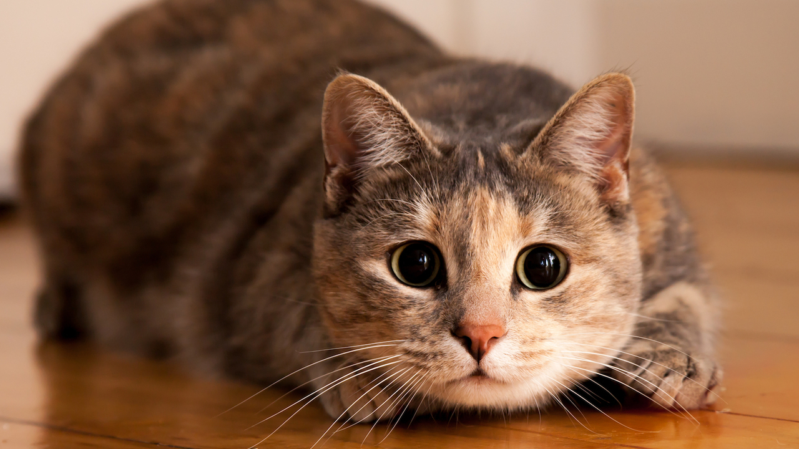

# Обучение Git

Перклчился на запасную ветку и начал работать

Добавляю информацию

Добавляю еще инфу (в третьей ветке)

 Создал ветку для добавления фото и добавил фотку кота

# Вторая запись

ну поехали делать новые записи тут